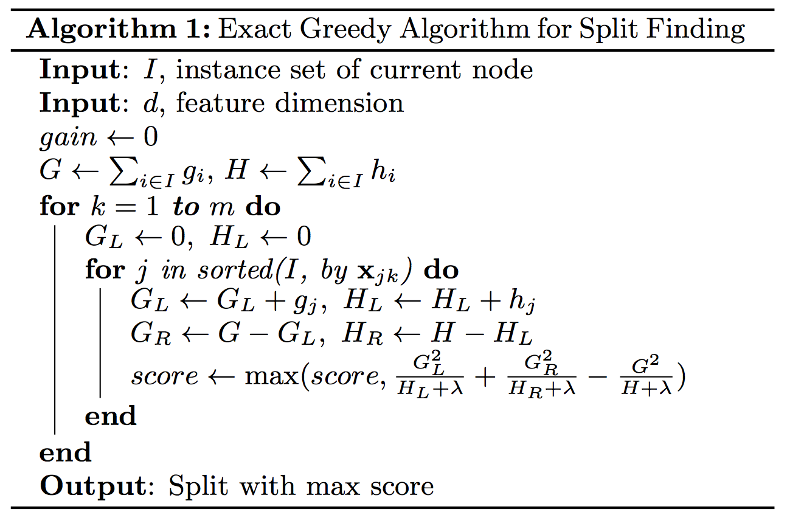
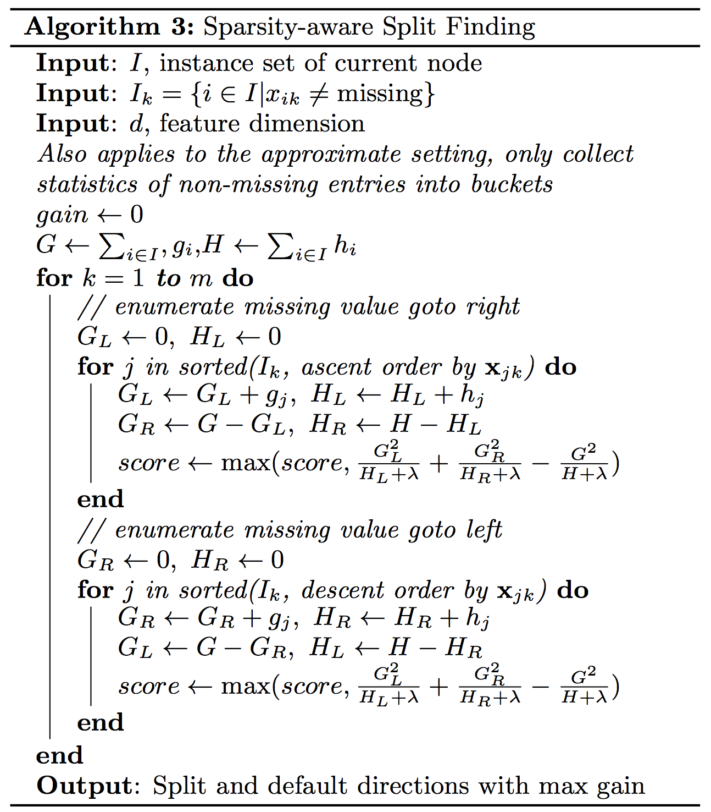
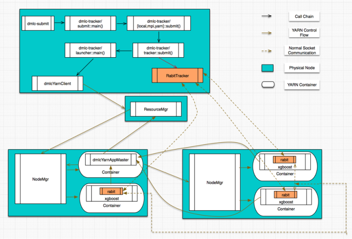

# Updater

在XGBoost里为了性能优化，既提供了单机多线程并行加速，也支持多机分布式加速。也就提供了若干种不同的并行建树的updater实现(均在tree目录下)，按并行策略的不同，包括：

(1). inter-feature exact parallelism （特征级精确并行）

(2). inter-feature approximate parallelism（特征级近似并行，基于特征分bin计算，减少了枚举所有特征分裂点的开销）

(3). intra-feature parallelism （特征内并行）

(4). inter-node parallelism  （多机并行）

此外，为了避免过拟合，还提供了一个用于对树进行剪枝的updater(TreePruner)，以及一个用于在分布式场景下完成结点模型参数信息通信的updater(TreeSyncher)，这样设计，关于建树的主要操作都可以通过Updater链的方式串接起来，是Decorator设计模式的一种应用。

XGBoost的实现中，最重要的就是建树环节，而建树对应的代码中，最主要的也是Updater的实现。

## ColMaker（单机版的inter-feature exact parallelism）

ColMaker建树操作大致如下：

```
updater_colmaker.cc:
ColMaker::Update()
     -> Builder builder;
     -> builder.Update()
          -> InitData()
          -> InitNewNode() // 为可用于split的树结点（即叶子结点，初始情况下只有一个叶结点，也就是根结点) 计算统计量，包括gain/weight等
          ->  for (depth = 0; depth < 树的最大深度; ++depth)
               -> FindSplit()
                    -> for (each feature) // 通过OpenMP获取inter-feature parallelism
                         -> UpdateSolution()      
                              -> EnumerateSplit()  // 每个执行线程处理一个特征，选出每个特征的最优split point
                              // 多个执行线程同时处理一个特征，选出该特征的最优split point; 
                              // 在每个线程里汇总各个线程内分配到的数据样本的统计量(grad/hess);
                              // aggregate所有线程的样本统计(grad/hess)， 计算出每个线程分配到的样本集合的边界特征值作为split point的最优分割点;
                              // 在每个线程分配到的样本集合对应的特征值集合进行枚举作为split point，选出最优分割点
                              -> ParallelFindSplit()   
                         // 上面的UpdateSolution()/ParallelFindSplit()会为所有待扩展分割的叶结点找到特征维度的最优split point，
                         // 比如对于叶结点A，OpenMP线程1会找到特征F1的最优split point，OpenMP线程2会找到特征F2的最优split point，
                         // 所以需要进行全局sync，找到叶结点A的最优split point。
                         -> SyncBestSolution()  
                         -> 为需要进行分割的叶结点创建孩子结点     
               -> ResetPosition() 
                // 根据上一步的分割动作，更新样本到树结点的映射关系
                // Missing Value(i.e. default)和非Missing Value(i.e.non-default)分别处理
               -> UpdateQueueExpand() 
                // 将待扩展分割的叶子结点用于替换qexpand_，作为下一轮split的起始基础
               -> InitNewNode()  // 为可用于split的树结点计算统计量
```

ColMaker的整个建树操作中，最关键的地方是用于支持intra-feature parallelism的ParallelFindSplit()的实现。

以上是对XGBoost单机多线程的精确建树算法的介绍，在官方论文里，对于这个算法有一个更好的描述:    



单机版本的实现中，另一个重要的细节是对于稀疏离散特征的支持，在这方面，XGBoost的实现做了比较细致的工程优化考量：



在XGBoost里，对于稀疏性的离散特征，在寻找split point的时候，不会对该特征为missing的样本进行遍历统计，只对该列特征值为non-missing的样本上对应的特征值进行遍历，通过这个工程的方法来减少了为稀疏离散特征寻找split point的时间开销。在逻辑实现上，为了保证完备性，会分别处理将missing该特征值的样本分配到左叶子结点和右叶子结点的两种情形。

在XGBoost里，单机多线程，并没有通过显式的pthread这样的方式来实现，而是通过OpenMP来完成多线程的处理。

单机实现中，另一个重要的updater是TreePruner，这是一个为了减少overfit，在loss函数的正则项之外提供的额外正则化手段，实现逻辑也比较直观，对于已经构造好的Tree结构，判断每个叶子结点，如果这个叶子结点的父结点分裂所带来的loss变化小于配置文件中规定的阈值，就会把这个叶子结点和它的兄弟结点合并回父结点里，并且这个pruning操作会递归下去。

上面介绍的是精确的建模算法，在XGBoost中，出于性能优化的考虑，也提供了近似的建模算法支持，核心思想是在寻找split point的时候，不会枚举所有的特征值，而会对特征值进行聚合统计，然后形成若干个bucket，只将bucket边界上的特征值作为split point的候选，从而获得性能提升。


## 分布式实现

了解分布式XGBoost，需要从计算任务的调度管理和核心算法分布式实现这两个角度展开。

计算任务的调度管理，在RABIT里提供了native MPI/Sun Grid Engine/YARN这三种方式。XGboost on YARN这种模式涉及到的细节则最多，包括YARN ApplicationMaster/Client的开发、Tracker脚本的开发、RABIT容错通信原语的开发以及基于RABIT原语的XGBoost算法分布式实现。如下图：



在这个图中，有几个需要介绍的角色：

- Tracker：这其实是一个Python写的脚本程序，主要完成的工作有：

       1). 启动daemon服务，提供worker结点注册联接所需的end point，所有的worker结点都可以通过与Tracker程序通信来完成自身状态信息的注册

       2). co-ordinate worker结点的执行：为worker结点分配Rank编号。基于收到的worker注册信息完成网络结构的构建，并广播给worker结点，以确保worker结点之间建立起合规的网络拓扑。当所有的worker结点都建立起完备的网络拓扑关系以后，就可以启动计算任务监控整个执行过程。

- Application Master：这其实是基于YARN AM接口的一个实现，完成的就是常规的YARN Application Master的功能。
- Client：这其实是基于YARN Client接口的一个实现。
- Worker：对应于实际的计算任务，本质上，每个worker结点（在YARN里应该称之为一个容器，因为一个结点上可以启动多个YARN容器）里都会启动一个XGBoost进程。这些XGBoost进程在初始化阶段，会通过与Tracker之间通信，完成自身信息的注册，同时会从Tracker里获取到完整的网络结构信息，从而完成通信所需的网络拓扑结构的构建。
- RABIT Library：RABIT实现的通信原语，目前只支持allreduce和broadcast这两个原语，并且提供了一定的fault-tolerance支持（RABIT通信框架中存在Tracker这个单点，所以只能在一定程度上支持Worker上的错误异常，基本的实现套路是，基于YARN的failure recovery机制，对于transient network error以及硬件down机这样的异常都提供了一定程度的支持）。
- XGBoost Process：在单机版的逻辑之外，还提供了用于Worker之间通信的相关逻辑，主要的通信数据包括：树模型的最新参数(从Rank 0结点到其他结点)每次分裂叶子结点时，为了计算最优split point，所需从各个结点汇总的统计量，包括近似算法里为了propose split point所需的bucket信息、训练样本的梯度信息等（从其他结点到Rank 0结点）